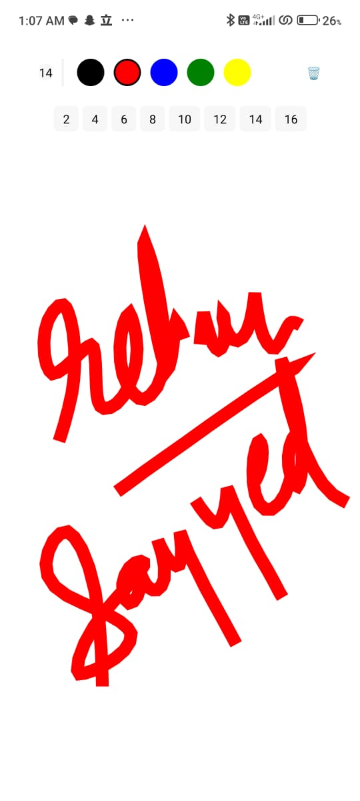
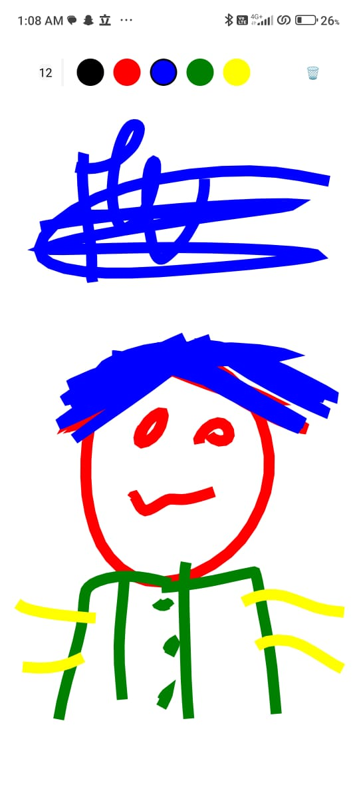

# SketchIt - React Native Drawing App

SketchIt is a simple drawing application built with React Native, allowing users to express their creativity by drawing on a canvas using touch gestures.

## Screenshots




## Features

- **Canvas Interaction**: Users can draw freely on the canvas using touch gestures.
- **Toolbar Functionality**: The app provides a toolbar with controls for adjusting drawing attributes such as color, stroke width, and canvas clearing.
- **Color Selection**: Choose from a range of colors provided in the color palette.
- **Stroke Width Adjustment**: Adjust the thickness of the drawing stroke with ease.
- **Component Coordination**: The App Component manages state for drawing paths, color selection, stroke width, and the visibility of stroke options.

## Installation

1. Clone the repository:
   ```
   git clone https://github.com/rsayyed591/sketchit.git
   ```
2. Navigate to the project directory:
   ```
   cd sketchit
   ```
3. Install dependencies:
   ```
   npm install
   ```
4. Run the project:
   ```
   npm start
   ```

## Technologies Used

- React Native
- @shopify/react-native-skia

## How to Use

1. Use touch gestures to draw on the canvas.
2. Adjust drawing attributes such as color and stroke width using the toolbar.
3. Clear the canvas when needed.
4. Enjoy expressing your creativity with SketchIt!

## Credits

This project was created by [Rehan Sayyed]. Feel free to contribute or report issues on the [GitHub repository](https://github.com/rsayyed591/sketchit.git).
